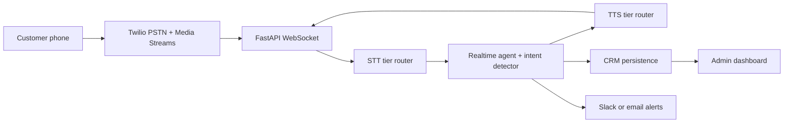

# VahanAI Studio Architecture

```mermaid
flowchart LR
  Customer["Customer phone"] --> Twilio["Twilio PSTN + Media Streams"]
  Twilio --> WS["FastAPI WebSocket"]
  WS --> STT["STT tier router"]
  STT --> LLM["Realtime agent + intent detector"]
  LLM --> TTS["TTS tier router"]
  TTS --> WS
  LLM --> CRM["CRM persistence"]
  LLM --> Alerts["Slack or email alerts"]
  CRM --> Dashboard["Admin dashboard"]
```

Phase 0 provides the open-source provider layer and debug API surface. Later
phases add full CRM persistence, analytics, dashboard UI, simulator, and studio.
